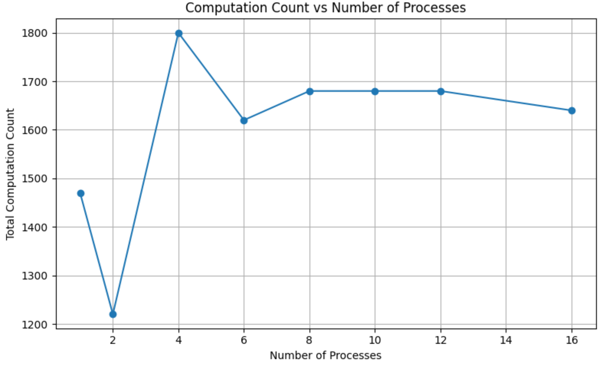
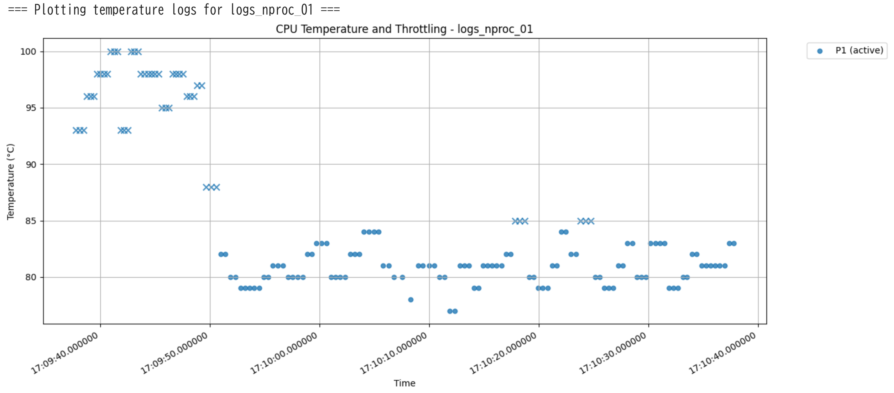

# Thermal-Aware Parallel Experiments

This project provides a Python-based framework for benchmarking CPU performance under thermal constraints, with a focus on understanding how parallel workload scaling interacts with temperature, throttling, and computation throughput.

## Features

- Parallel CPU workload generation using configurable number of processes
- Real-time CPU temperature monitoring using OpenHardwareMonitor
- Logging of temperature and workload iterations over time
- Automatic force-stop if CPU temperature remains high for a critical duration
- Optional pause-on-overheat mechanism (disabled by default)
- Jupyter notebook for cross-experiment analysis and visualization

## Requirements

- Python 3.x
- OpenHardwareMonitor (v0.9.6 recommended)  
  Must be located at:  
  ``openhardwaremonitor-v0.9.6/OpenHardwareMonitor/OpenHardwareMonitor.exe``
- Python packages:
  - ``numpy``
  - ``pandas``
  - ``matplotlib``
  - ``psutil``
  - ``requests``

Install dependencies with:

``pip install numpy pandas matplotlib psutil requests``

## Usage

### 1. Run Experiments

To execute tests across different numbers of worker processes:

``python experiment_runner.py``

This will:
- Run tests with process counts such as 1, 2, 4, ..., 16
- Launch worker processes that perform CPU-intensive matrix multiplications
- Monitor and log CPU temperature every 0.1 seconds
- Wait 60 seconds between each test for cooldown

Each run creates logs in folders like ``logs_nproc_04/`` with a CSV file for each worker process.

### 2. Analyze Results

Open the following Jupyter notebook:

``compare_experiments.ipynb``

You can compare:
- Computation count per process count
- Temperature profiles
- Throttling events
- Process scaling efficiency

## Temperature Safety

To protect hardware:

- If temperature exceeds a threshold (default: ``85°C``) for more than 30 seconds, all processes are terminated.
- This adds a software-level layer of thermal protection beyond hardware throttling or shutdown mechanisms.
- An optional pause-on-overheat mode is included but **disabled by default**. It allows the program to wait when overheating instead of stopping entirely.

Customize the temperature threshold using:

``TEMP_THRESHOLD=90.0 python experiment_runner.py``

## Log Format

Each process generates ``log_{proc_id}.csv`` with:

- ``timestamp`` – ISO 8601 format
- ``temperature`` – Measured CPU temperature (°C)
- ``throttling`` – ``True`` if the program paused due to high temp, otherwise ``False``
- ``count`` – Matrix multiplication iteration count

Note: ``throttling`` here refers to application-level pauses, not hardware-level frequency scaling.

## Performance Insights

### Optimal Number of Processes

The chart below shows total computation count per process count. It was recorded on an Intel(R) Core(TM) i7-1065G7 (4 cores, 8 threads).

- The peak occurs at 4 processes — matching the number of physical CPU cores.
- Performance decreases or plateaus beyond this due to scheduling overhead or thermal limitations.
- The 2-process dip may stem from transient throttling or uneven core allocation.

### Thermal Behavior Example

Below is a temperature log for 1 process (``logs_nproc_01``):

- Initially, the temperature rapidly rises past the 85°C threshold.
- After a short period, the temperature stabilizes around 80°C.
- This stabilization suggests **hardware-level thermal throttling** is actively regulating the system by reducing CPU frequency or redistributing power.

## License

MIT License
